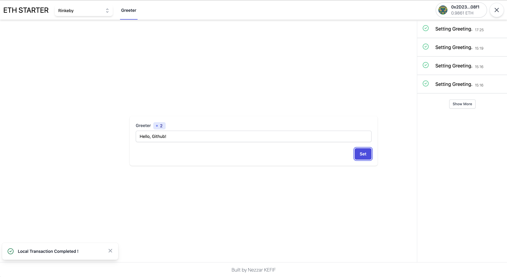

# 🔌 ETH Basic Typescript Starter

This monorepo should allow you to get started with a simple Greeter smart contract on localhost and Rinkeby in record time with this basic react stack using

- Typescript
- NextJS
- 👷 [Hardhat](https://hardhat.org/)
- 🤝 [useDapp](https://usedapp.readthedocs.io/en/latest/)
- Tailwind CSS
- Redux Toolkit
- Yarn Workspace

Heavily influenced by Scaffold-Eth and the existing [Typescript branch](https://github.com/austintgriffith/scaffold-eth/tree/nextjs-typescript). Go 🏗 [check it out](https://github.com/austintgriffith/scaffold-eth) 🏗 if you haven't !

# Get Started

Clone the project and install dependencies,

```
git clone https://github.com/nezz0746/typescript-eth-starter.git
cd eth-starter
yarn install
```

Then open 3 separate terminals and run

1. Start your local node

```
yarn chain
```

2. Deploy your Greeter contract to your local node with

```
yarn deploy
```

3. Then start your frontend !

```
yarn dev
```

Finnally, open <http://localhost:3000> to see the app.

You frontend should be live on localhost and ready to submit and new `setGreeting` transaction to the local chain !

Here is what it should look like when launched !



## Deploy on Rinkeby

TODO
